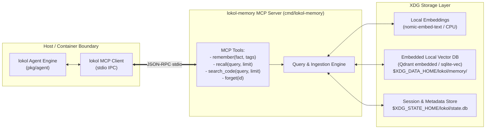

# ADR 0008: XDG Persistent Memory Architecture via Local Vector DB and MCP Facade

## Status
Accepted

## Date
2026-09-20

## Context
Across all operational modes (`general`, `moe`, `coding`), conversational agents suffer from session amnesia: once a process exits, prior discoveries, decisions, user preferences, and repository insights evaporate.

Naive solutions (such as dumping raw `MEMORY.md` files or unbounded conversation logs directly into the system prompt) quickly overflow the model's KV context budget (32k–64k tokens) and dilute attention. 

We need a persistent memory architecture that satisfies four requirements:
1. **Long-Term Retrieval Across All Modes**: Store user preferences, facts, and conversation takeaways permanently.
2. **Codebase Semantic Indexing for Coding Mode**: Quickly locate relevant functions, interfaces, and architecture decisions without loading whole directory trees.
3. **Local-First & Private**: Run 100% on the local host with zero external cloud API dependencies.
4. **Decoupled Architecture (MCP as Facade)**: Storage engines and vector algorithms evolve rapidly. The agent should communicate through an invariant protocol rather than hardcoded DB bindings.

## Decision

### 1. Architectural Model: The MCP Storage Facade
We adopt the **Model Context Protocol (MCP)** as a stable abstraction facade over local storage and indexing engines.

- **Invariant Interface**: The `lokol` core binary interacts only with standard MCP tool definitions (`remember`, `recall`, `search_code`).
- **Replaceable Storage Engine**: Whether backed by embedded Qdrant (`qdrant-server` embedded/local), `sqlite-vec`, or flat files, the agent's code remains completely unchanged.

### 2. XDG Storage Placement
Persistent memory complies strictly with [ADR-0006](0006-xdg-base-directory-specification.md):
- **Index Data & Vector Collections**: Stored in `${XDG_DATA_HOME:-~/.local/share}/lokol/memory/`.
- **Runtime Session State & Journaling**: Stored in `${XDG_STATE_HOME:-~/.local/state}/lokol/`.
- **Volatile Embedding Caches**: Stored in `${XDG_CACHE_HOME:-~/.cache}/lokol/embeddings/`.

### 3. Memory Lifecycle & Indexing Protocol
1. **Passive Fact Ingestion (`remember`)**:
   - In `general` mode: At natural conversational boundaries, the agent extracts discrete facts, user preferences, and project goals, storing them as tagged vector documents.
   - In `coding` mode: Extracts architectural decisions, test conventions, and verified error resolutions.
2. **Context-Sensitive Retrieval (`recall`)**:
   - Before forming the final turn prompt, the agent generates a semantic query against the local vector store, retrieving the Top 3–5 most relevant memory snippets (<500 tokens).
3. **Source Code Semantic Search (`search_code`)**:
   - Dedicated collection indexing workspace AST signatures and comments, allowing sub-second symbol lookups without running noisy disk greps.

## Consequences

### Positive
- **Zero Lock-In**: Swapping vector storage backends (e.g., from Qdrant to sqlite-vec or vice versa) only requires updating the MCP server implementation without touching `lokol` agent core.
- **Context Hygiene**: Replaces multi-thousand-token conversation replay with surgical, relevant memory fragments.
- **Cross-Session Continuity**: Agents pick up exactly where past sessions left off, remembering established preferences and conventions.

### Negative / Trade-offs
- Requires local embedding generation (e.g. `nomic-embed-text-v1.5` on CPU via llama-server port 8081 or embedded Go inference).
- Small disk space footprint for local vector index files in `~/.local/share/lokol/memory/`.
