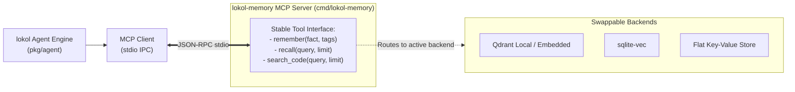

# ADR 0012: MCP Storage Facade for Memory and Retrieval Engines

## Status
Accepted

## Date
2026-09-20

## Context
As decided in [ADR-0011](0011-local-vector-database-adoption.md), `lokol` utilizes local vector databases and embedding pipelines to index memories and source code.

However, vector storage technologies and embedding algorithms are evolving at an extraordinary pace (e.g. Qdrant embedded, sqlite-vec, DuckDB VSS, Chromadb). Tightly coupling the core `lokol` agent binary to a specific vector database library or CGO binding creates significant technical liabilities:
1. Recompiling `lokol` would be required every time the vector storage backend or embedding model changes.
2. Linking C++ or Rust vector libraries into the Go binary compromises cross-platform static binary portability (`CGO_ENABLED=0`).
3. The memory subsystem cannot be easily reused by other agent harnesses or tools.

We need an architectural pattern that decouples the agent logic from the physical storage engines.

## Decision
We adopt the **Facade Pattern via Model Context Protocol (MCP)** for all memory and vector retrieval subsystems:

1. **Stable Agent Tooling Facade**:
   - The `lokol` agent engine interacts exclusively with a defined set of high-level MCP tools:
     - `remember(fact, tags)`: Ingest a discrete memory into long-term storage.
     - `recall(query, limit)`: Query top relevant memories by semantic meaning.
     - `search_code(query, limit)`: Query top relevant code symbols and AST chunks.
     - `forget(id)`: Remove obsolete or invalid memories.
2. **Process Isolation & Swappable Backends**:
   - The memory tools are served by a standalone binary (`lokol-memory`) communicating with `lokol` via standard MCP JSON-RPC over stdio.
   - The backend engine (Qdrant, sqlite-vec, or future vector engines) is entirely encapsulated behind the `lokol-memory` server. Swapping the vector backend requires zero changes to the `lokol` agent core.
3. **Multi-Client Reusability**:
   - Because `lokol-memory` implements standard MCP, external tools (such as Claude Code, Cursor, or `agent-sandbox` agents) can attach to the same memory server.

## Consequences

### Positive
- **Architectural Decoupling**: Complete separation between agent orchestration and vector storage mechanics.
- **Portability Maintained**: The core `lokol` CLI remains a lightweight, pure-Go static binary with zero heavy vector database dependencies.
- **Interchangeable Backends**: Future backends can be swapped or customized without regressions in the core agent loop.

### Negative / Trade-offs
- Minimal IPC latency overhead via JSON-RPC stdio (sub-millisecond, negligible compared to LLM token inference times).
- Requires shipping or orchestrating the `lokol-memory` companion binary.
