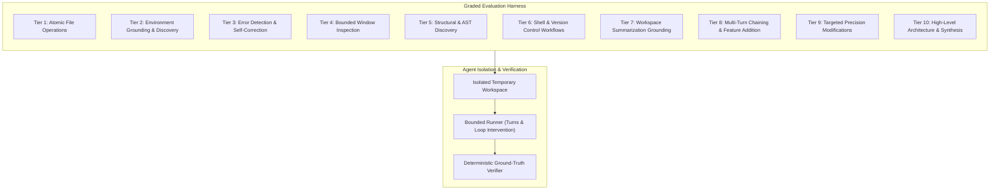

# ADR 0013: Graded Multi-Tier Integration Benchmark Suite

## Status
Accepted

## Date
2026-09-27

## Context
Evaluating autonomous coding agents running against local, constrained models (7B and 3B parameter scales) is notoriously difficult. Unlike traditional deterministic software where unit tests provide binary pass/fail guarantees, LLM agent behavior is non-deterministic. Relying on subjective chatbot interaction or manual QA quickly leads to regressions:
- Agents get stuck in infinite retry loops repeating failed edits.
- Small models lose spatial grounding regarding their working directory or existing files.
- Minor prompt or tool contract adjustments can break multi-turn tool chaining.
- Using an autoregressive chat LLM as a "judge" (LLM-as-a-judge) is slow, resource-heavy, prone to hallucinations, and circular when evaluating small models.

We need a deterministic, reproducible evaluation test harness integrated directly into the testing workflow that measures tool invocation correctness, error recovery, and task completion across increasing levels of complexity.

## Decision
We implement a **Graded Multi-Tier Integration Evaluation Suite** that executes against the live local inference engine.

### 1. Progressive Difficulty Tiers
The evaluation scenarios are organized into progressive tiers of increasing reasoning depth:
1. **Atomic Operations**: Single-turn file creation and schema adherence.
2. **Environment Grounding**: Workspace discovery and directory awareness.
3. **Self-Correction & Test Execution**: Detecting failures, applying targeted fixes, and re-verifying.
4. **Bounded Window Inspection**: Targeted extraction from large files to preserve context budgets.
5. **Structural Discovery**: Extracting types, interfaces, and function signatures.
6. **Shell & Version Control**: Staging, configuring, and committing within source control.
7. **Workspace Summarization**: Grounded summarization without hallucinating non-existent assets.
8. **Multi-Turn Feature Addition**: Iterative cycles of discovery, modification, and verification.
9. **Precision Replacements**: Targeted modifications within large or complex files.
10. **Architecture Synthesis**: High-level semantic synthesis and multi-file analysis.

### 2. Strict Workspace Isolation
Every evaluation case runs in a clean, dedicated temporary workspace. Tools operate strictly within this isolated boundary, preventing cross-test contamination or side effects.

### 3. Loop Breaking & Resilient Intervention
The evaluation harness exercises the runner's oscillation and loop detection mechanisms:
- Repetition tracking halts identical action loops when progress stalls.
- System intervention nudges are injected into the message stream when duplicate errors recur.

### 4. Deterministic Verification
Rather than evaluating loose model prose, tiers verify physical state changes:
- Correct structured data parsing and property validation.
- Clean exit codes from verification tools within the modified workspace.
- Proper source control commit history and tree state.
- File existence and exact content validation.

## Consequences

### Positive
- **Deterministic Quality Gate**: Provides a verifiable benchmark for measuring agent capabilities and preventing regressions when adjusting prompts or tool schemas.
- **Fast Execution**: Tiers execute rapidly against local models on standard consumer hardware.
- **Clear Failure Localization**: Pinpoints the exact turn or tool where reasoning broke down.

### Negative / Trade-offs
- Requires a running local inference engine to execute live benchmarks (tests skip gracefully if engine is offline).
- Multi-turn tiers require calibrating turn bounds to accommodate iterative self-correction cycles.
