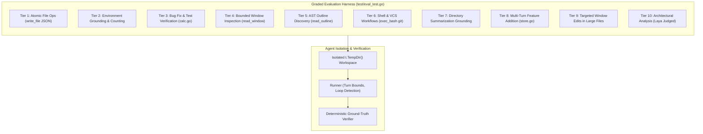

# ADR 0013: Graded Multi-Tier Integration Benchmark Suite

## Status
Accepted

## Date
2026-09-27

## Context
Evaluating autonomous coding agents running against local, constrained models (7B and 3B parameter scales) is notoriously difficult. Unlike traditional deterministic software where unit tests provide binary pass/fail guarantees, LLM agent behavior is non-deterministic. However, relying on subjective chatbot interaction or manual QA quickly leads to regressions:
- Agents get stuck in infinite retry loops repeating failed edits.
- Small models lose spatial grounding regarding their working directory or existing files.
- Minor prompt or tool contract adjustments can break multi-turn tool chaining.
- Using an autoregressive chat LLM as a "judge" (LLM-as-a-judge) is slow, expensive, prone to hallucinations, and circular when evaluating small models.

We need a deterministic, reproducible evaluation test harness integrated directly into the `lokol` testing workflow that measures tool invocation correctness, error recovery, and task completion across increasing levels of complexity.

## Decision
We implement a **Graded Multi-Tier Integration Evaluation Suite** in [`test/eval_test.go`](../../test/eval_test.go) that runs against the live local inference engine (`llama-server`).

### 1. Progressive Difficulty Tiers
The evaluation cases are organized into discrete tiers:
1. **Tier 1 (Atomic Operations)**: Single-turn JSON file creation and schema adherence.
2. **Tier 2 (Environment Inspection)**: File counting and directory awareness.
3. **Tier 3 (Self-Correction & Test Execution)**: Identifying test failure via `run_test`, fixing code via `replace_file`, and verifying fix.
4. **Tier 4 (Bounded Window Reads)**: Extracting specific tokens from large files without dumping whole files into context.
5. **Tier 5 (AST Outline Discovery)**: Identifying structs and types using `read_outline`.
6. **Tier 6 (Shell & Version Control)**: Git repository initialization, configuration, staging, and committing via `exec_bash`.
7. **Tier 7 (Directory Summarization Grounding)**: Summarizing cwd files without hallucinating non-existent files.
8. **Tier 8 (Multi-Turn Chaining & Feature Addition)**: Reading outlines, inspecting windows, adding methods, updating unit tests, and verifying with `run_test`.
9. **Tier 9 (Precision Window Replacements)**: Modifying specific constants buried deep inside large files.
10. **Tier 10 (Subjective Documentation & Semantic Synthesis)**: Analyzing multi-file relationships and producing architectural overviews.

### 2. Strict Workspace Isolation
Every evaluation case runs in a clean, dedicated `t.TempDir()`. Tools operate strictly within this directory (`WorkDir`), preventing side effects or contamination across test cases.

### 3. Loop Breaking & Resilient Intervention
The evaluation harness exercises the runner's oscillation and loop detection mechanisms (`TestRunner_LoopCircuitBreaker`):
- Repetition tracking halts identical action loops after 4 consecutive failures.
- System intervention nudges (`[SYSTEM INTERVENTION: Loop detected]`) are automatically injected into the message stream when duplicate errors occur.

### 4. Deterministic Verification
Rather than evaluating loose model prose, each tier verifies physical state changes:
- Correct JSON unmarshaling and property validation.
- Exit code zero of `go test ./...` in the modified workspace.
- Proper Git commit messages and tree state.
- File existence and exact string matching.

## Consequences

### Positive
- **Deterministic Quality Gate**: Provides a verifiable benchmark for measuring agent capabilities and preventing regressions when tweaking system prompts or tool schemas.
- **Fast Execution**: All 10 tiers execute in ~80 seconds against local 7B models on standard consumer hardware.
- **Clear Failure Localization**: Failures pinpoint the exact tool or turn where reasoning broke down (e.g., failed window reading vs failed replace target).

### Negative / Trade-offs
- Requires a running local inference engine (`llama-server`) to execute live benchmarks (tests skip gracefully if engine is offline).
- Multi-turn tiers require calibrating `MaxTurns` (e.g., 10–15 turns) to accommodate iterative self-correction cycles.
