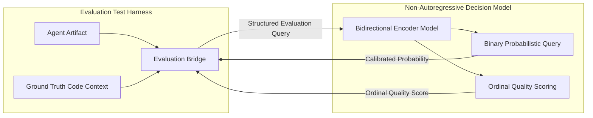

# ADR 0014: Non-Autoregressive Decision Models for Semantic Evaluation

## Status
Accepted

## Date
2026-09-27

## Context
Certain software engineering tasks cannot be verified by compiler passes or exit codes alone. When an agent generates architecture documentation, summarizes a system's control flow, or explains a module interface, determining whether the output is faithful to the codebase requires semantic evaluation.

The conventional industry approach ("LLM-as-a-judge") uses a secondary generative chat model to evaluate the primary model's output. However, in local, constrained development environments:
1. **High Latency & VRAM Competition**: Running a secondary generative model consumes significant GPU memory and takes several seconds per evaluation turn, bottlenecking test suites.
2. **Generative Variance & Instability**: Autoregressive token generation introduces temperature variance, verbose formatting issues, and hallucination in the judge itself.
3. **Flaky Output Extraction**: Parsing judge scores out of free-form conversational prose requires brittle regular expressions.

We require a fast, deterministic, non-autoregressive evaluator to assess semantic correctness and output fidelity without employing an autoregressive chat LLM.

## Decision
We adopt **non-autoregressive decision models** as the semantic evaluation engine for integration testing and artifact judging.

### 1. Non-Autoregressive Decision Architecture
The decision model utilizes a bidirectional encoder backbone to evaluate typed decision queries in a single forward pass:
- **Zero Token Generation**: Does not generate text tokens autoregressively.
- **Typed Query Structure**:
  - Binary queries return calibrated probabilities for whether an artifact satisfies technical requirements.
  - Ordinal queries evaluate criteria along a bounded, discrete scale.

### 2. Decoupled Subprocess Execution
The evaluator operates as a decoupled subprocess with a clean boundary:
- Accepts evaluation payload and query instructions via structured input.
- Returns deterministic probabilities and quality scores over standard output.
- Avoids runtime library or memory coupling with the primary Go agent binary.

### 3. Threshold-Gated Evaluation
The evaluation harness integrates semantic judging as an objective gate:
- Applies probability and quality score thresholds alongside deterministic lexical assertions.
- Provides fallback assertions when the decision engine is unavailable in constrained or offline environments.

## Consequences

### Positive
- **Deterministic & Repeatable**: Semantic evaluation produces calibrated probabilities rather than erratic token completions.
- **Sub-100ms Evaluation**: Forward pass evaluation completes orders of magnitude faster than generative chat models.
- **Lightweight Resource Footprint**: Runs efficiently on CPU or GPU without competing with the primary generative model for VRAM.
- **Elimination of Self-Evaluation Bias**: Separates the verification system from the agent's generative weights.

### Negative / Trade-offs
- Requires downloading decision model weights during initial environment bootstrap.
- Relies on an auxiliary runtime environment for model execution (tests fall back cleanly to lexical verification when absent).
