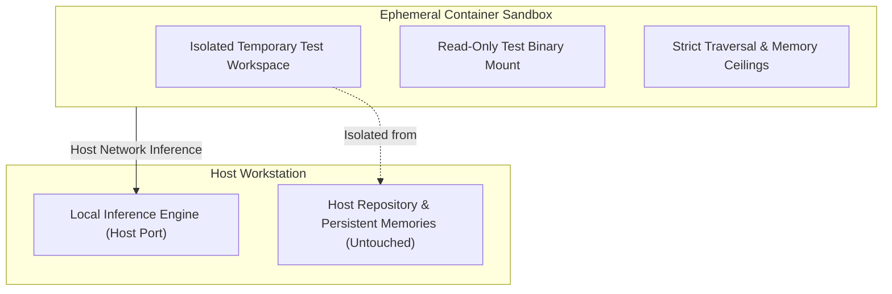

# ADR 0016: Containerized Test Sandboxing for Host Memory and State Isolation

## Status
Accepted

## Date
2026-09-27

## Context
Autonomous coding agents operate by inspecting directories, modifying source files, executing shell commands, and invoking verification tests.

When evaluating autonomous agent behavior across end-to-end tasks, direct execution on the host machine presents critical boundary risks:
1. **Host Memory & State Contamination**: Version control systems and issue trackers often discover repository state by walking upward through parent directories. If an agent executes state-recording commands or modifies files within a subfolder, it risks mutating the host repository's database, issue graph, or commit history.
2. **Workstation File Contamination**: Build artifacts or temporary binaries compiled during test runs can pollute the host working tree and violate repository hygiene.
3. **Network Routing for Local Inference**: The agent under test must access the local inference engine without granting the container access to host files or sensitive environment state.

We require an airtight sandboxing strategy for executing autonomous agent evaluations without any possibility of host memory or workspace contamination.

## Decision
We adopt **containerized sandboxing** for executing integration evaluations of autonomous agent behavior against scoped test projects.

### 1. Rootless Ephemeral Container Isolation
Agent integration benchmarks that evaluate autonomous reasoning execute inside ephemeral, rootless container sandboxes with isolated process namespaces.

### 2. Isolated Scoped Test Workspaces
Evaluations construct self-contained, scoped project workspaces within temporary directories and mount them into the container. All file modifications, tool calls, and created assets remain strictly bounded within the container sandbox.

### 3. Ephemeral Binary Mounting
Test binaries must never be built into or written to the repository root. Test harnesses compile temporary binaries into isolated scratch directories, mount them into the container as read-only executables, and ensure they are automatically reaped upon test completion.

### 4. Memory & Directory Ceiling Enforcement
To guarantee that neither the containerized agent nor its subcommands touch host state:
- Inside the container, environment ceilings prevent upward directory traversal from discovering host version control or issue stores.
- Host tool runners similarly enforce workspace ceilings during command execution.

### 5. Host Network Binding for Local Inference
Containers utilize host network routing to communicate directly with the local inference engine. This enables zero-latency model inference without exposing host filesystem mounts.

### 6. Graceful Degradation
If container runtime tools or the local inference engine are unavailable, containerized integration tests skip gracefully so offline unit test suites continue to pass.

## Consequences

### Positive
- **Guaranteed Host Protection**: Host issue trackers, persistent memories, and repository files are physically inaccessible to the agent under test.
- **Clean Repository Root**: Prevents rogue binaries or test artifacts from polluting the project root.
- **Authentic End-to-End Validation**: Evaluates the agent in a clean POSIX environment with real developer toolchains.

### Negative / Trade-offs
- Executing containerized tests requires a container engine installed on the host.
- Container initialization introduces a minor runtime overhead during test execution.
