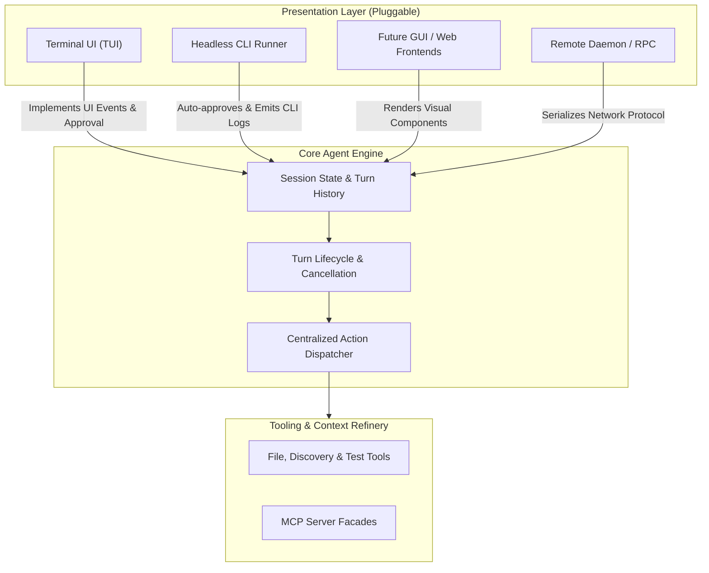

# ADR 0017: Decoupled Core Agent Engine from Presentation Layers

## Status
Accepted

## Date
2026-09-27

## Context
As an autonomous coding agent, `lokol` operates across multiple execution contexts:
1. Interactive terminal sessions with live status and approval workflows.
2. Headless non-interactive execution for automated tasks and CI pipelines.
3. Potential future interfaces, such as desktop graphical interfaces, web dashboards, or remote daemon services.

In early iterations, interactive turn management, streaming coordination, cancellation handling, and tool execution were embedded directly inside the terminal interface model, while headless execution maintained its own separate execution loop. This coupling introduces architectural risks:
- **Duplicated Tool Dispatching**: Adding new tools requires parallel wiring across both the headless runner and the terminal UI.
- **Presentation Lock-In**: Alternative presentation layers cannot reuse the agent loop without duplicating session state, token streaming, and tool execution logic.
- **Testing Impedance**: Testing agent behavior requires simulating UI-specific message cycles rather than testing pure session state transitions.

We require a clean architectural separation between the core agent engine and all presentation layers.

## Decision
We decouple the **Core Agent Engine** from all **Presentation Layers** using a unified Session and Event model.

### 1. Presentation-Agnostic Core Session
The core engine owns:
- Conversational turn history and prompt hierarchy composition.
- Token streaming, context cancellation, and inference slot lifecycle management.
- Action parsing and single-source tool execution.
- Loop detection, circuit breaking, and repetition intervention.

### 2. Event-Driven Presentation Boundary
Presentation layers do not execute tools or manage turn loops. Instead, they interact with the session via an event and callback contract:
- **Streaming Events**: Real-time notifications of incoming token streams.
- **Approval Hooks**: Intercept proposed tool actions to solicit user approval or trigger autonomous execution.
- **Execution Lifecycle**: Notifications when actions begin executing and when tool results return.
- **Task Completion**: Notifications when a task completes or fails.

### 3. Centralized Action Dispatcher
All tool execution logic is unified into a single dispatcher within the core engine. When new tools or capabilities are introduced, they are registered once in the core engine and immediately become available across all present and future presentation layers without modifying UI code.

## Consequences

### Positive
- **Single Source of Truth**: Eliminates duplicated action dispatching across headless and interactive modes.
- **True Multi-Frontend Extensibility**: New frontends (web, desktop GUI, CLI) require only implementing visual rendering and approval callbacks.
- **Isolated Testing**: Core agent reasoning and tool workflows can be tested directly without UI framework dependencies.
- **Zero UI-Tool Drift**: Guarantees that interactive and headless modes behave identically when executing tools.

### Negative / Trade-offs
- Requires passing events through asynchronous callback or channel boundaries between the engine and UI event loops.
