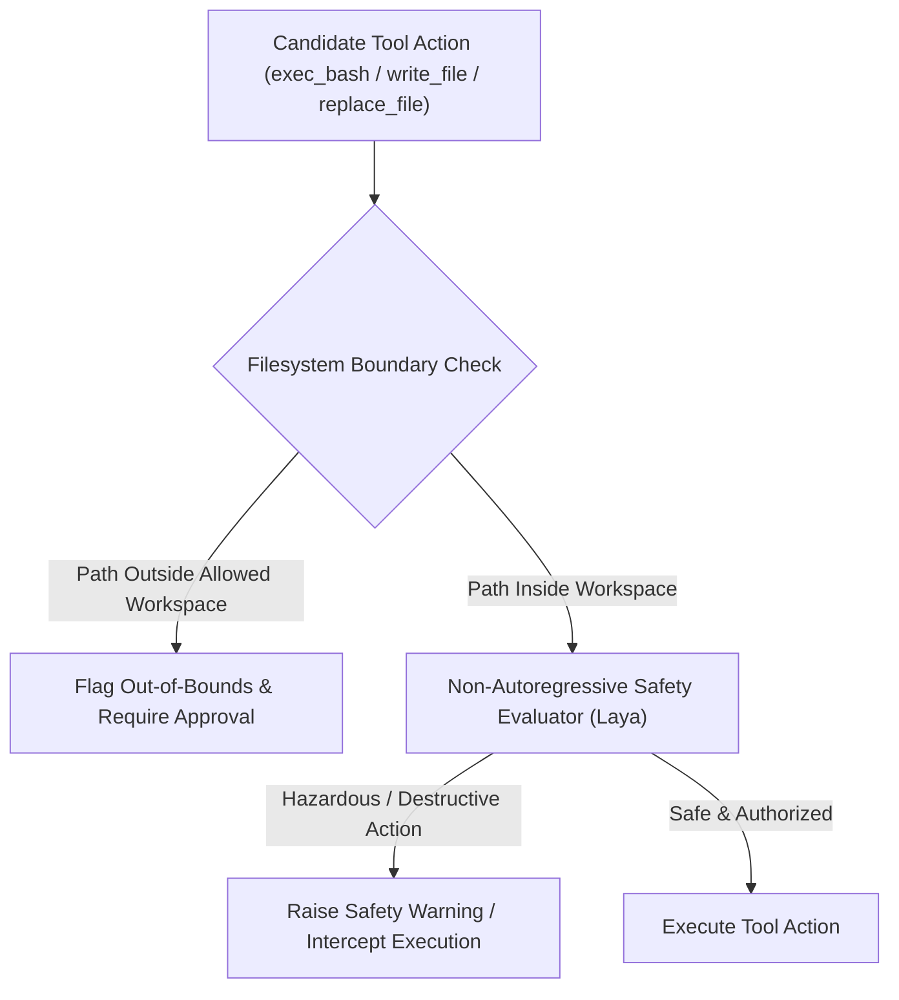

# ADR 0019: Non-Autoregressive Runtime Guardrails and Filesystem Permissions

## Status
Accepted

## Date
2026-09-27

## Context
When local AI agents execute autonomous actions on a user's machine, tool operations (`exec_bash`, `write_file`, `replace_file`) carry inherent host security risks:
1. **Filesystem Boundary Traversal**: An agent may inadvertently or incorrectly read, modify, or delete files outside the intended project workspace (e.g., home directories, parent workspaces, dotfiles, or sensitive credential stores like `~/.ssh` or `~/.aws`).
2. **Destructive Shell Execution**: Bash commands generated by local LLMs can contain unintentionally destructive or hazardous instructions (e.g. recursive deletions, environment variable exfiltration, or network pipe installations).
3. **Latency and Resource Constraints of Traditional LLM Guardrails**: Using a secondary generative chat model as a safety guardrail consumes scarce consumer VRAM, competes with the primary agent loop, and adds multiple seconds of latency per turn.
4. **Fragility of Heuristic Keyword Blocklists**: Static regexes or command blocklists are brittle, prone to false positives, and easily evaded by bash aliases, variable substitutions, and subshells.

We require a fast, deterministic, low-overhead safety and permissions verification layer that enforces workspace isolation and flags dangerous operations before tool execution.

## Decision
We adopt **non-autoregressive decision models (Laya)** paired with canonical filesystem boundaries as the core permissions and safety guardrail engine for `lokol`.

### 1. Dual-Phase Verification Pipeline
All agent tool calls pass through a unified pre-execution verification pipeline before reaching the execution runner:
- **Phase 1: Canonical Path Containment**: Resolves physical canonical paths against the declared workspace root. Any access outside the allowed workspace hierarchy triggers a boundary permission violation.
- **Phase 2: Semantic Safety Decision**: For shell executions and complex file mutations, the non-autoregressive decision model evaluates the candidate action in a single sub-50ms forward pass, returning calibrated risk probabilities rather than open-ended text.

### 2. Centralized Permission Enforcement
- **Headless Mode (`lokol exec`)**: High-risk or out-of-bounds operations immediately abort the execution loop unless explicit override policies are passed.
- **Interactive TUI Mode (`lk`)**: Flagged actions are visibly highlighted in the approval modal with specific boundary or risk notifications, giving the operator informed oversight.

### 3. Resource & Latency Efficiency
By leveraging non-autoregressive decision models rather than secondary generative chat LLMs:
- Guardrail checks execute in ~30ms.
- Host VRAM remains 100% dedicated to the active local model without cache eviction or model swapping.

## Consequences

### Positive
- **Host Security**: Strictly confines agent modifications to designated project directories.
- **Zero Generative Latency**: Safety evaluation occurs without multi-second autoregressive generation delays.
- **Explainable Decisions**: Decision models provide calibrated probability scores for security auditing and user confirmation prompts.

### Negative / Trade-offs
- Commands with complex shell expansions or dynamic workspace references may require explicit operator approval in interactive mode.
