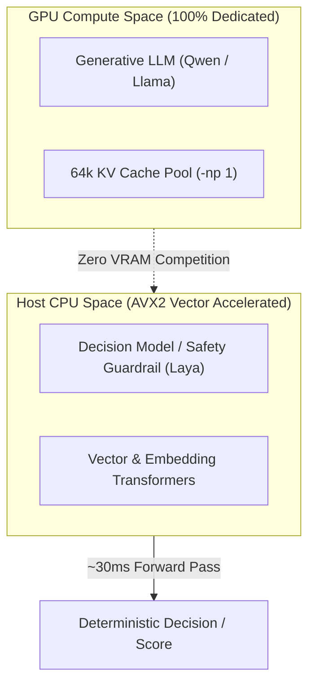

# ADR 0020: CPU AVX2 Offload Strategy for Auxiliary Decision Models

## Status
Accepted

## Date
2026-09-27

## Context
Local AI workflows on consumer hardware operate under strict GPU memory constraints:
- Consumer GPUs frequently possess between 4 GB and 12 GB of VRAM (e.g., GTX 1650, RTX 3060, RTX 4060).
- Our hardware tiering policy ([ADR-0002](0002-hardware-tiering-and-constrained-vram.md)) allocates 100% of available VRAM to a single dedicated engine slot (`-np 1`) to maximize the generative model's KV cache and context window (up to 64k tokens) with zero host RAM spillover.
- Introducing auxiliary models—such as safety guardrails, prompt routing classifiers, or semantic decision judges—onto the GPU would trigger immediate VRAM competition, cache eviction, or out-of-memory (OOM) failures on entry-level hardware.
- Unlike generative language models that generate hundreds of sequential tokens autoregressively, decision models (such as Laya / ModernBERT) process inputs in a **single non-autoregressive forward pass**.

We need an execution strategy for auxiliary decision models that introduces zero VRAM footprint and does not perturb the primary inference engine.

## Decision
We establish **CPU AVX2 Offloading** as the architectural policy for all auxiliary decision models and semantic guardrails:

### 1. Dedicated Hardware Partitioning
- **Primary Generative Engine (`llama-server`)**: Owns 100% of GPU compute and VRAM.
- **Auxiliary Decision Models & Evaluators**: Run strictly on the host CPU utilizing vector instruction sets (AVX2 / AVX-512 on x86_64, NEON on ARM64).

### 2. Latency Budget vs VRAM Trade-off
- On modern consumer CPUs, a single non-autoregressive forward pass of a 100M–300M parameter encoder model executes in **~25ms to 45ms** under AVX2 acceleration.
- In contrast to multi-second generative token generation, a ~35ms CPU evaluation introduces imperceptible overhead into interactive or autonomous loops while preserving 100% of GPU memory headroom.

## Consequences

### Positive
- **Zero VRAM Contention**: Eliminates VRAM fragmentation, model swapping, and context cache eviction on constrained GPUs (e.g., ThinkPad GTX 1650 4GB).
- **Guaranteed Concurrency**: Primary generation and safety evaluation can run simultaneously without blocking GPU compute streams.
- **Broad Portability**: AVX2 vector instructions are standard across virtually all x86_64 processors produced over the last decade, with equivalent vector parity on Apple Silicon / ARM64.

### Negative / Trade-offs
- Systems lacking AVX2 vector extensions fall back to standard scalar CPU operations, increasing forward pass latency to ~150–200ms.
