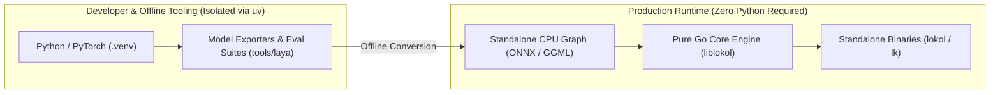

# ADR 0021: Zero-Python Production Runtime Dependency Policy

## Status
Accepted

## Date
2026-09-27

## Context
A primary design tenet of `lokol` is delivering a frictionless, local-first autonomous agent compiled to standalone, portable binaries (`lokol`, `lk`, `liblokol`).

While Python is widely used in AI development, introducing Python or PyTorch as a production dependency carries severe penalties:
1. **Excessive Storage Footprint**: PyTorch and supporting ML libraries (`transformers`, `safetensors`) require between 2 GB and 3.5 GB of disk space.
2. **Environment Fragility**: Runtime Python dependencies frequently suffer from version drift, virtualenv conflicts, missing system C libraries, and dynamic linker failures across various Linux distributions and macOS versions.
3. **Installation Friction**: Forcing operators to install Python >= 3.12, create virtual environments, and resolve pip wheels degrades the out-of-the-box user experience.
4. **Process Overhead**: Invoking Python runtimes for auxiliary per-turn operations adds subprocess startup latency and memory overhead.

We require a strict architectural policy regarding runtime language dependencies for production distributions.

## Decision
We enforce a **Zero-Python Production Runtime Dependency Policy** across all shipping binaries and core libraries:

### 1. Pure Go Core Functionality
All essential agent operations—including filesystem containment, static shell safety inspection, deterministic action protocols, terminal presentation, and tool dispatch—are implemented in pure, hermetic Go with zero external language dependencies.

### 2. Standalone Model Formats for Auxiliary Inference
When non-autoregressive decision models or embeddings are deployed in production, they must run through standalone native runtimes (e.g. ONNX Runtime CPU with AVX2 or static C/Go tensor engines) rather than active Python interpreters.

### 3. Isolation of Python to Development Tooling
Python scripts are strictly confined to offline developer tooling, dataset preparation, and test harness evaluations under `./tools/*`, managed via `uv` ([ADR-0015](0015-auxiliary-tooling-isolation-via-uv.md)). They are never required on an operator's production machine.

## Consequences

### Positive
- **Single-Binary Distribution**: Users can install and run `lokol` and `lk` via a single curl script without downloading gigabytes of Python packages.
- **Instant Startup**: Zero interpreter boot overhead or module import latency.
- **Reliable Portability**: Eliminates Python path, wheel, and glibc compatibility failures.

### Negative / Trade-offs
- Adding new neural models requires an offline export step (e.g. PyTorch to ONNX) rather than loading PyTorch checkpoints directly at runtime.
