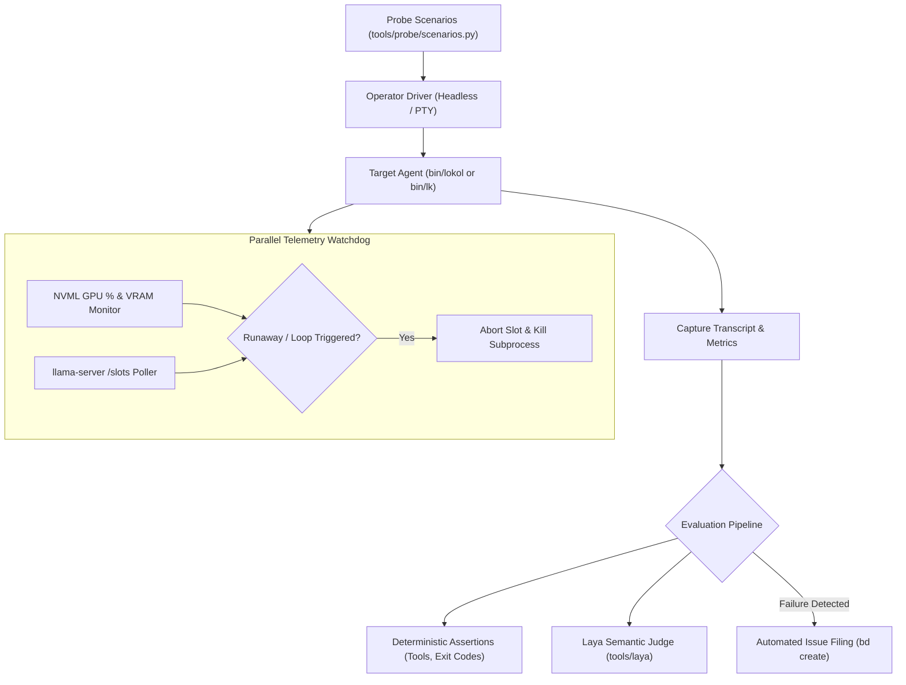

# ADR 0023: Autonomous Operator Driver and Hardware Telemetry Watchdog Harness

## Status
Accepted

## Date
2026-09-28

## Context
When deploying local-first autonomous agents powered by 7B–8B parameter models on consumer hardware:
1. **Unconstrained Generation Runaways**: Open-ended conversational or meta-prompts can trigger repetitive reasoning or unbounded token streaming, pinning the GPU at 100% utilization until manually aborted.
2. **RLHF Hallucinations & Evasion**: When challenged on capabilities, base instruction-tuned models frequently revert to cloud LLM training tropes—falsely claiming they have no GPU, cannot access local files, or inventing definitions (e.g. interpreting MCP as "Model Card Project").
3. **Lack of Automated Operator Simulation**: Testing interactive behavior manually in the Bubble Tea TUI (`bin/lk`) is non-reproducible, slow, and cannot systematically verify regressions across model weights or prompt changes.
4. **Missing Hardware Correlation**: Agent evaluation suites traditionally evaluate output strings in isolation without monitoring real-time GPU compute spikes, memory pressure, or engine slot state.

We require an automated operator driver harness in `tools/probe/` that simulates a human operator, monitors live hardware telemetry, terminates runaways mid-stream, scores responses using the Laya semantic judge, and automatically files issues in Beads (`bd`).

## Decision
We implement a **Python-based Operator Simulation & Telemetry Harness** located in `tools/probe/`:

### 1. Dual-Mode Operator Execution
- **Headless Mode (`bin/lokol -p`)**: Default mode for high-speed, hermetic capability testing and CI regression verification. Bypasses terminal escape formatting.
- **Interactive PTY Mode (`bin/lk`)**: Simulates a human operator within a pseudo-terminal (`ptyprocess` / `pexpect`), sending keystrokes, approving/rejecting action modals, and simulating operator aborts (`Esc`).

### 2. Parallel Hardware & Slot Telemetry Watchdog
A background monitoring thread tracks physical resource consumption at 100ms intervals:
- **NVML Telemetry**: Queries GPU compute utilization (%) and VRAM usage.
- **Engine Slot State**: Queries `http://127.0.0.1:8080/slots` to monitor prompt processing tokens, generation progress, and KV cache allocation.
- **Runaway Circuit Breakers**:
  - *Compute Pegging*: Automatically terminates the process if the GPU is pegged at >85% for longer than the allowable prompt budget without emitting a tool action tag.
  - *Context Explosion*: Intercepts generations that exceed turn token thresholds.
  - *Slot Release*: When terminating a runaway agent, the watchdog proactively calls `POST /slots?action=release` to immediately flush the KV cache on `llama-server`.

### 3. Multi-Tiered Evaluation (Deterministic + Laya Semantic Judge)
- **Deterministic Checks**: Validates tool invocation syntax, exit codes, and required keywords (e.g. detected GPU device name).
- **Laya Semantic Judge**: Passes the full trajectory to `tools/laya/judge.py` to evaluate:
  - *Grounding & Truthfulness*: Detects false assertions regarding lack of GPU access or workspace capabilities.
  - *Evasiveness*: Flags default RLHF boilerplate refusing user instructions.
  - *Overall Quality*: Calibrated scoring on a 5-point scale.

### 4. Closed-Loop Issue Tracking via Beads (`bd create`)
When a scenario fails or triggers the runaway watchdog:
- The harness compiles a structured markdown diagnostic bundle including prompt, token transcript, GPU utilization timeline, Laya score, and stack trace.
- Invokes `bd create` with label `agent-probe` and priority `P2` to register the defect directly into the repository's local Dolt issue tracker.

## Consequences

### Positive
- **Automated Regression Defense**: Catches token runaway and evasive loops before code is committed or merged.
- **Hardware-Aware Testing**: Correlates model output directly with GPU load and KV cache pressure.
- **Zero Host Freeze**: Watchdog prevents long-running unconstrained generation loops from locking up developer machines.
- **Autonomous Feedback Loop**: Automatically translates agent behavioral bugs into actionable Beads issues.

### Negative / Trade-offs
- Requires Python 3.12+ and `uv` in developer environments (`uv run --python .venv tools/probe/...`).
- GPU telemetry via NVML requires NVIDIA drivers on host machines; the harness gracefully falls back to CPU/RAM tracking on non-CUDA environments.
