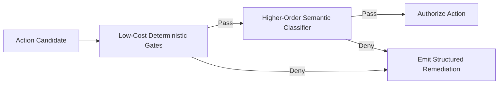

# ADR 0023: Functional Regulator Action-Gating Pipeline

## Status
Accepted

## Date
2026-09-28

## Context
Autonomous agent governance requires mediating tool invocations before execution occurs. Historically, security enforcement was conceived as passive "guardrails"—static blocklists and perimeter checks preventing unauthorized path traversal or known dangerous commands.

This framing presents several architectural limitations:
1. **Passive vs. Active Governance**: "Guardrails" treats safety as a binary perimeter fence. Governing an autonomous agent requires active regulation: dynamically mediating execution permissions, bounding resource budgets, validating semantic intent, and providing course correction.
2. **Monolithic Procedural Coupling**: Hardcoding distinct validation rules into a monolithic procedural validator tightly couples unrelated concerns (syntactic validation, filesystem containment, shell analysis, and semantic evaluation). This prevents modular extension, unit testing in isolation, and per-persona policy tailoring.
3. **Latency vs. Semantic Coverage**: Purely deterministic checks (regex, string prefixing) execute in microseconds but cannot identify obfuscated or contextually inappropriate actions. Conversely, delegating every action to a semantic model introduces intolerable latency.

We need a composable, functional pipeline architecture that regulates agent actions with both high computational efficiency and semantic fidelity.

## Decision
We establish a **Functional Regulator Action-Gating Pipeline** to mediate all agent tool execution candidates:

### 1. Functional Stage Composition
The regulator models action validation as an ordered sequence of pure, composable filter stages. Each stage receives the candidate action and context, returning a discrete decision (allow, warn, or deny) alongside explanatory rationale.

### 2. Cost-Ordered Staging & Short-Circuiting
Pipeline stages are strictly ordered by ascending computational cost:
- **Syntactic & Structural Validation**: Verifies schema conformity, argument integrity, and parameter bounds.
- **Boundary & Containment Enforcement**: Verifies workspace boundaries, path containment, and prevents directory traversal escapes.
- **Static Command Analysis**: Identifies destructive signatures, privilege escalation, and unsafe execution patterns.
- **Semantic Classification**: Applies non-autoregressive decision models to classify ambiguous or context-dependent operations.

The pipeline short-circuits on the first denying stage. Computationally expensive stages are evaluated only when all preceding deterministic checks succeed.

### 3. Actionable Remediation Feedback
Rejection is not treated as a terminal error. When an action is denied, the regulator generates structured remediation guidance explaining why the action was rejected and providing the permissible alternative. This feedback is injected into the agent's context, transforming rejections into self-correction signals and preventing blind retry loops.

### 4. Mode-Adaptive Enforcement
The regulator supports mode-dependent enforcement policies:
- **Autonomous Mode**: Gating rejections immediately short-circuit to remediation feedback, allowing autonomous self-correction without operator intervention.
- **Interactive Mode**: High-risk or warning decisions disengage auto-approval and present explicit confirmation options to the operator.

## Consequences

### Positive
- **Active Systemic Governance**: Unifies boundary safety, policy validation, and behavioral guidance into a cohesive subsystem.
- **Optimal Latency Profile**: Ordering stages by computational complexity ensures standard operations clear in microseconds, reserving semantic evaluation for complex actions.
- **Reduced Looping & Failure Recovery**: Structured remediation directly instructs the agent on valid tool alternatives, mitigating repetitive failure cycles.
- **Composable Extensibility**: New regulatory checks can be added, tested, and composed independently without modifying the execution engine.

### Negative / Trade-offs
- **Pipeline Orchestration Overhead**: Managing a staged pipeline introduces more architectural surface area than a monolithic validation function.
- **Statelessness Requirement**: Stages must remain strictly stateless to avoid hidden coupling and ensure deterministic evaluation across invocations.
