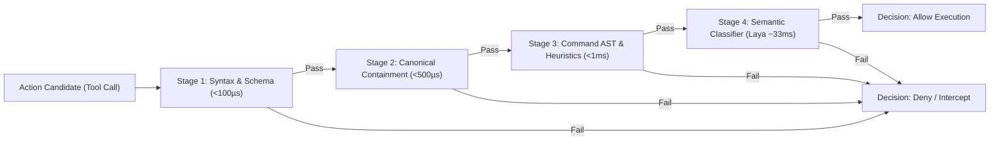

# ADR 0024: Functional Regulator Action-Gating Pipeline

## Status
Accepted

## Date
2026-09-28

## Context
In ADR 0019, we introduced a pre-execution permissions pipeline under the `guardrail` package to enforce filesystem containment and block destructive shell invocations. While effective, the concept of "guardrails" carries architectural limitations:
1. **Passive Framing**: "Guardrails" suggests passive perimeter fencing or static blocklists. In practice, governing an autonomous agent requires active **regulation**—coordinating security boundaries, resource budgets, behavioral policies, and execution permissions.
2. **Monolithic Evaluation**: Hardcoding disparate security checks into a single procedural validator impedes extensibility and makes it difficult to compose new checks or adjust policy per operational mode (`general`, `coding`, `moe`).
3. **Absence of Semantic Classification**: Deterministic regex and path checks catch obvious hazards (e.g. `rm -rf /` or directory traversal), but cannot discern nuanced adversarial drift, evasion, or contextually inappropriate actions without prohibitive LLM judge latency.

We need to reframe and refactor the subsystem into a **Functional Regulator Pipeline** that gates agent actions with high computational and wall-clock efficiency.

## Decision
We transition the `guardrail` subsystem to a modular, functional pipeline under `liblokol/regulator`:



### 1. Functional Stage Composition
The Regulator evaluates candidate actions through an ordered sequence of pure, composable filter stages:

```go
type Stage func(ctx context.Context, target TargetSummary) Decision

type Decision struct {
    Status      Status // Allowed, Warn, Blocked
    Reason      string
    Remediation string // Optional guidance instructing agent how to self-correct
    StageName   string
}
```

The pipeline executes stages in order of **increasing computational cost**:
1. **Stage 1: Schema & Payload Sanitization (< 100 µs)**: Verifies XML tags, argument structures, and bounded line counts (e.g., rejecting unbounded window reads).
2. **Stage 2: Canonical Filesystem Boundary Containment (< 500 µs)**: Evaluates canonical target paths against the workspace boundary, blocking traversal escapes and access to sensitive stores (`~/.ssh`, `~/.aws`, `/etc`).
3. **Stage 3: Static Command & AST Inspection (< 1 ms)**: Inspects shell commands against high-risk destructive signatures (`rm -rf /`, raw disk writes, fork bombs) and privilege escalation (`sudo`, `doas`).
4. **Stage 4: Semantic Intent Classification via Laya (~33 ms)**: Uses Convai's non-autoregressive decision model (ModernBERT-based, CPU AVX2 offloaded per ADR 0020) to classify ambiguous, multi-step, or obfuscated actions without chat LLM token variance.

### 2. Early-Exit Short-Circuiting
If any fast stage rejects an action, subsequent stages are bypassed immediately. The average latency for safe local actions remains under 2 milliseconds; only complex or borderline actions incur the ~33ms semantic classification pass.

### 3. Actionable Remediation Feedback
Denial decisions do not merely halt the agent with an error. Each rejection produces structured remediation guidance returned to the agent inside reciprocal `<action_result>` tags:
- *Example*: Rejecting a directory target for `read_window` supplies the exact `<action name="find_files">` syntax required to succeed.
- Enables autonomous recovery and eliminates trial-and-error looping.

### 4. Interactive & Autonomous Policy Handlers
- **Autonomous Mode (Headless / YOLO)**: Rejections immediately feed remediation back to the agent session.
- **Interactive TUI Mode (`lk`)**: Warnings (`Decision.Status == Warn`) trigger visual warning banners and disengage auto-approval, prompting the human operator for explicit confirmation.

## Consequences

### Positive
- **Clear Conceptual Framing**: Positions safety, resource defense, and semantic gating under an active, cohesive Regulator subsystem.
- **Microsecond-to-Sub-50ms Efficiency**: Strict stage ordering ensures 95%+ of operations clear within `< 2ms`, while semantic checks run in ~33ms.
- **Zero Python Runtime Dependency in Production**: Stage 4 evaluates via native Go ONNX bindings or IPC, adhering to ADR 0021.
- **Composable Extensibility**: Adding new mode-specific rules or organizational policies simply requires appending a `Stage` function to the pipeline.

### Negative / Trade-offs
- Refactoring `liblokol/guardrail` to `liblokol/regulator` requires updating internal call sites across `agent/runner.go`, `cmd/lk/tui/tui.go`, and test fixtures.
