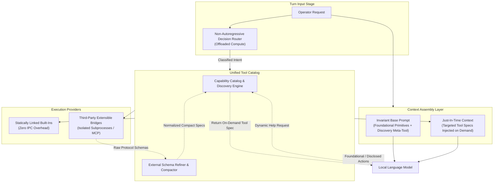

# ADR 0024: Progressive Tool Disclosure and Catalog Architecture

## Status
Accepted

## Date
2026-09-28

## Context
As an autonomous coding agent's capabilities expand, its inventory of operational tools (workspace exploration, content search, version control inspection, test verification, semantic memory retrieval, and external environment integrations) grows steadily.

Statically enumerating all tool specifications, parameter schemas, and formatting rules within the agent's base system prompt introduces several critical failure modes for local inference:

1. **Context Budget Exhaustion**:
   In VRAM-constrained local environments, large system prompts consume a substantial fraction of the finite context window, reducing the remaining capacity available for source code reasoning, workspace context, and multi-turn problem solving.
2. **Attention Dilution and Schema Confusion**:
   Small language models (3B to 8B parameters) experience cognitive degradation when presented with dozens of candidate tools simultaneously. Attention entropy leads to format conflation, hallucinated parameters, phantom schema emissions, and inaccurate tool dispatch.
3. **External Protocol Impedance**:
   Extensible tooling protocols (such as the Model Context Protocol) frequently expose verbose JSON Schema definitions containing extensive nested properties, metadata, and validation rules. Injecting raw external schemas into local model prompts overwhelms the attention heads of small models.
4. **Execution Performance Divergence**:
   While external extensibility requires inter-process communication and serialized protocol bridges, internal foundational capabilities (such as local file reading, editing, and workspace discovery) perform best when executed directly in-process without serialization overhead or process management hazards.

A purely static system prompt does not scale with expanding capabilities, while completely hiding tools behind opaque query functions risks paralyzing reactive small models.

## Decision
We establish a **Progressive Tool Disclosure and Catalog Architecture** governed by the following architectural principles:

### 1. Foundational Invariant Substrate
A minimal, constant baseline of foundational primitives remains permanently resident in the base system prompt. This substrate covers core workspace interactions (discovering files, reading bounded windows, targeted file modifications, and task completion) along with a universal discovery meta-tool. This ensures the agent is never paralyzed and can always orient itself in a workspace without discovery overhead.

### 2. Progressive Tool Disclosure
All specialized, domain-specific, or peripheral tools are omitted from the base system prompt and maintained within a centralized tool catalog. The base system prompt exposes only a compact summary of available capability domains. Detailed tool calling syntax, parameter specifications, and execution constraints are disclosed to the model strictly on demand.

### 3. Auxiliary Decision-Model Intent Pre-Routing
To overcome the passivity of small models without bloating the base prompt, incoming operator requests are evaluated pre-flight by an auxiliary non-autoregressive decision model running on offloaded compute (such as host CPU AVX2). When a clear intent matching a specialized tool domain is recognized, the catalog dynamically pre-populates the required tool specifications into the immediate turn context, eliminating speculative discovery turns while keeping the base prompt invariant.

### 4. Reactive Discovery Safety Net
When intent routing does not identify a specialized domain or when a multi-step task evolves mid-execution, the agent leverages the discovery meta-tool to query the catalog for tool specifications. Furthermore, if the agent attempts an action matching a known catalog tool using malformed syntax, the execution engine responds with the exact tool specification to guide immediate self-correction.

### 5. Unified Hybrid Execution Boundary
The catalog serves as a single unified abstraction layer across two distinct execution paradigms:
- **In-Process Built-ins**: Foundational and performance-critical internal operations execute directly in-process with zero serialization or inter-process communication overhead.
- **External Extensibility Bridges**: Third-party plugins and external protocol servers execute across isolated, sandboxed process boundaries.

To the language model, both execution paradigms present a uniform, predictable interaction contract.

### 6. Attention Shield for External Schemas
The catalog acts as an attention firewall between external tooling specifications and the local model. Complex, verbose schemas emitted by third-party tooling servers are ingested, stripped of extraneous metadata, and refined into compact, model-optimized specifications before being made available for progressive disclosure.

## Consequences

### Positive
- **Invariant Base Prompt Size**: Adding new tools or third-party extensions adds zero tokens to the base system prompt, preserving KV cache capacity and prefix-cache reuse across turns.
- **Maximized Attention Sharpness**: The model's attention heads are never burdened with irrelevant tool schemas, substantially reducing format confusion and phantom emissions.
- **Protection from Third-Party Bloat**: External integrations cannot degrade the agent's core reasoning through verbose schema injection.
- **Optimal Execution Performance**: Avoids unnecessary IPC and serialization overhead for internal, built-in operations while maintaining full architectural extensibility.

### Negative
- **Discovery Turn Latency**: When intent pre-routing does not trigger and an unfamiliar specialized tool is required, the agent must spend an additional conversational turn to discover and inspect the tool specification.
- **Catalog Normalization Overhead**: Ingesting third-party tool specifications requires maintaining schema compaction and transformation logic.
