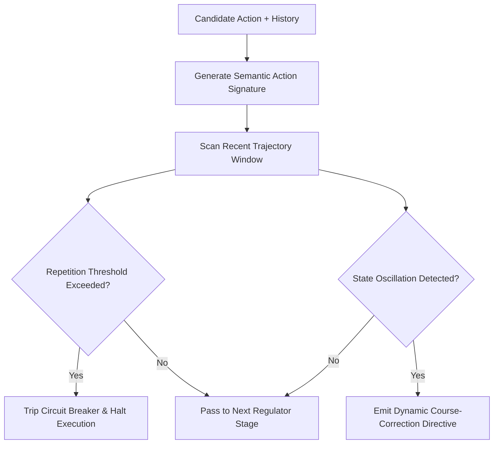

# ADR 0025: Dynamic Loop Circuit Breaking and Oscillation Governance

## Status
Accepted

## Date
2026-09-28

## Context
Autonomous agents running against local inference models frequently encounter cognitive feedback traps when tools produce unexpected outputs or errors. When an operation fails—such as an exact string replacement finding no match, or a file read returning a directory error—small models tend to re-emit the identical command repeatedly rather than adjusting their strategy.

Historically, loop mitigation has been addressed with basic turn counters or ad-hoc procedural checks embedded within presentation layers and runner loops. This approach presents several architectural defects:
1. **Scattered and Duplicated Heuristics**: Circuit-breaking logic implemented inside specific runners or terminal interfaces cannot govern alternative presentation layers (headless execution, IPC daemons, testing harnesses).
2. **Delayed Intervention**: Turn-budget limits only trip when the entire task budget is exhausted, wasting precious compute and token capacity on repeated dead ends.
3. **Lack of State Oscillation Detection**: Simple repetition counters fail when an agent ping-pongs between two alternating commands (e.g., read file A, read file B, read file A, read file B).

We require a centralized, stateless regulatory stage that detects repetitive execution patterns and halts runaway loops early.

## Decision
We integrate a **Dynamic Loop Circuit Breaker Stage** into the functional regulator pipeline:

### 1. Semantic Action Signatures
The circuit breaker hashes or normalizes action candidates into canonical semantic signatures based on tool identity, targeted resources, and primary arguments. Irrelevant formatting differences or whitespace do not mask repetitive execution.

### 2. Bounded Trajectory Window Inspection
The regulator inspects a bounded sliding window of recent action history:
- **Consecutive Identical Failures**: Identical tool failures repeated beyond a small threshold trigger an immediate execution halt.
- **Runaway Passive Inspection**: Consecutive read-only exploration actions without code modification or test verification trigger trajectory warnings.
- **Ping-Pong State Oscillation**: Cyclic repetition between two or three alternating states is flagged to force strategy diversification.

### 3. Progressive Intervention Protocol
The regulator enforces progressive governance:
1. **Guidance Injection (Turn 2)**: Injects targeted corrective advice into the execution context.
2. **Strategy Shift Directive (Turn 3)**: Prohibits the repeated action type and demands an alternative tool.
3. **Hard Circuit Breaker Halt (Turn 4+)**: Immediately halts the autonomous session to prevent infinite token loops.

## Consequences

### Positive
- **Centralized Behavioral Governance**: Eliminates ad-hoc loop checks scattered across runner and UI packages.
- **Resource Protection**: Preserves local compute and token window by terminating non-convergent trajectories in fewer than 4 turns.
- **Hermetic Testability**: Loop detection heuristics can be evaluated against synthetic action sequences in complete isolation from external models or filesystems.

### Negative / Trade-offs
- **State Window Dependency**: Requires access to recent action trajectory history rather than evaluating isolated action candidates in complete isolation.
- **Threshold Tuning**: Overly aggressive thresholds could prematurely interrupt exploratory tasks requiring repeated queries.
