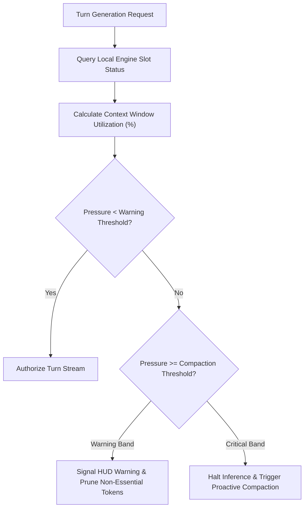

# ADR 0026: Inference Slot Pressure and Context Budget Regulation

## Status
Accepted

## Date
2026-09-28

## Context
Local inference engines operate under strict physical memory and KV-cache constraints. Unlike cloud APIs with elastic or multi-million token windows, local models (typically configured with 4K to 32K context windows) experience severe performance degradation or crash abruptly with out-of-memory errors when context limits are breached.

Traditionally, context exhaustion has been treated reactively: the inference server rejects a prompt, or an autonomous loop crashes mid-turn. To maintain unbroken multi-turn autonomy on consumer hardware, the agent requires a proactive **Resource and Slot Governor** within the regulatory pipeline that continuously tracks slot memory pressure and bounds token expenditures.

## Decision
We establish an **Inference Slot Pressure and Context Budget Regulator** that intercepts turns and action sequences based on real-time inference server metrics:

### 1. Slot Metric Ingestion
The regulator interfaces with the local inference server's status endpoints to sample real-time metrics:
- Allocated context window capacity.
- Accumulated prompt and cache memory consumption.
- Active slot utilization percentage.

### 2. Tiered Regulatory Thresholds
The regulator defines explicit operational bands:
- **Nominal Band**: Normal execution cadence within safe headroom without regulatory restriction.
- **Warning Band**: Approaching capacity limits, triggering visual pressure indicators in user interfaces and restricting non-essential diagnostic tool emissions.
- **Compaction Band**: Critical threshold where standard turns are proactively halted to trigger structured context compaction before engine truncation occurs.

### 3. Isolated Component Testing
The slot governor must be testable in total isolation from physical GPU hardware. It receives an abstract slot status provider, permitting deterministic verification of threshold triggers, warning emissions, and compaction signals across simulated context profiles (e.g., 2K, 8K, 32K).

## Consequences

### Positive
- **OOM Prevention**: Preempts engine crashes by catching context exhaustion before prompt submission.
- **Predictable Cadence**: Gives presentation layers and compaction routines deterministic advance notice before context limits are reached.
- **Hardware Agnostic**: Enforces uniform context percentage policies regardless of the host hardware's total VRAM or model architecture.

### Negative / Trade-offs
- **Network Sampling Overhead**: Periodic polling of slot status introduces minor local HTTP overhead (mitigated by caching and per-turn sampling).
- **Compaction Coordination Complexity**: Triggering compaction requires clean state handoffs between the regulator and the session history manager.
