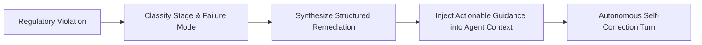

# ADR 0027: Structured Trajectory Remediation for Autonomous Recovery

## Status
Accepted

## Date
2026-09-28

## Context
When an autonomous agent proposes an impermissible or dangerous action (such as an out-of-bounds directory traversal, an unauthorized shell command, or a schema violation), naive security mechanisms simply block the call and emit a raw denial string (e.g., `Permission Denied`).

Small language models (3B–8B) interpret blunt denials as environmental failures rather than policy boundaries. In response, they frequently enter blind retry loops, repeating the forbidden command with superficial variations or halting prematurely in confusion.

To maintain reliable unattended execution, regulatory interventions must not merely reject candidate actions—they must provide constructive, structured remediation instructions that actively guide the model toward valid, permissible alternatives.

## Decision
We establish a **Structured Trajectory Remediation Protocol** integrated across all regulator stages:

### 1. Unified Remediation Schema
Every rejection emitted by any regulator stage (syntactic, boundary, static shell, semantic, or loop circuit breaker) must accompany its decision with a structured remediation object containing:
- **Violating Entity**: The specific parameter, command, or path that breached policy.
- **Enforcing Stage**: The specific regulatory stage that issued the rejection.
- **Causal Explanation**: Clear explanation of why the action violated policy.
- **Actionable Remedy**: Concrete instructions specifying which permissible tool, parameter pattern, or scoping rule to use instead.

### 2. Standardized Agent Context Injection
Remediation feedback is formatted into standard reciprocal action result messages:
- Denials are explicitly identified as regulatory interventions.
- Remediation guidance immediately follows the denial explanation.
- The tone and formatting provide prompt guidance directing the model to pivot to an authorized alternative rather than repeating the denied trajectory.

### 3. Component Isolation Testing
Remediation generation must be testable in isolation. Each regulatory stage must have dedicated tests asserting that every failure mode produces non-empty, actionable, and grammatically consistent remediation guidance.

## Consequences

### Positive
- **Mitigates Repetitive Retries**: Eliminates blind retry loops by explicitly giving the model the correct alternative tool or parameter pattern.
- **Autonomous Error Recovery**: Converts policy rejections into constructive learning signals, enabling unattended recovery from mistakes.
- **Standardized Developer Telemetry**: Operators and test harnesses can inspect the exact remediation guidance generated for any regulatory event.

### Negative / Trade-offs
- **Token Overhead**: Injecting detailed remediation instructions consumes more context tokens than a brief `Permission Denied` error string.
- **Guidance Accuracy Requirement**: Poorly formulated remediation advice could misdirect the model into unintended tool choices.
