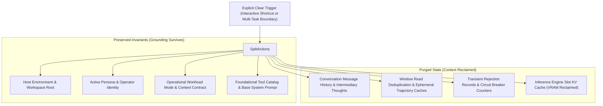

# ADR 0028: Explicit Context Clearing and State Retention Invariants

## Status
Accepted

## Date
2026-10-02

## Context
In long-running interactive terminal sessions and multi-task autonomous execution pipelines, conversation history and model attention caches grow monotonically. On consumer hardware with constrained VRAM, retaining stale multi-turn history degrades model reasoning, consumes bounded context budgets, and eventually leads to out-of-memory errors or context truncation.

Furthermore, user-triggered resets (such as clearing a screen or abandoning an exploratory tangent) have historically produced incomplete state cleanup: presentation logs were wiped while the inference engine continued holding populated KV caches, or operational environment metadata (host architecture, active persona, workspace root) was accidentally discarded alongside conversation turns.

A clear boundary is required between **explicit, operator- or boundary-driven context resets** and **automatic threshold-based context compaction** (which preserves ongoing task continuity under slot pressure). Explicit context clearing requires formal retention invariants and a deterministic engine slot release protocol.

## Decision
We establish a unified **Explicit Context Clearing and State Retention Protocol** across interactive terminal interfaces and headless multi-task execution boundaries.

### 1. Separation of Concerns: Explicit Reset vs. Compaction
- **Explicit Context Clearing**: Fully purges conversational trajectory, temporary inspection caches, and active engine KV slot allocations. Used when an operator explicitly clears context or when a headless runner crosses autonomous sub-task boundaries.
- **Automatic Context Compaction**: Governed independently by slot pressure thresholds, selectively compressing older conversation turns and pruning attention while preserving in-progress task execution.

### 2. State Retention Invariants
During an explicit reset, the session core enforces strict retention invariants:
- **Surviving State**: Host environment grounding (operating system, architecture, working directory, git branch), configured agent persona and operator names, active operational mode, workspace instruction contracts, and foundational tool schemas.
- **Purged State**: All conversational messages, assistant thoughts, tool invocation traces, trajectory inspection caches, consecutive repetition counters, transient regulatory rejections, and presentation view logs.

### 3. Inference Slot Cache Reclamation
Explicit clearing triggers an immediate slot cache release request to the local inference server. This frees accumulated KV cache allocations on the GPU, returning slot token utilization to zero and preventing stale prompt cache interference without requiring process termination or model reloads.

### 4. Headless Multi-Task Boundaries
Autonomous unattended runners must invoke the explicit clear protocol between discrete milestone tasks or specification steps. This prevents error trajectories and hallucinated context from earlier tasks from contaminating subsequent autonomous problem-solving phases.

## Consequences

### Positive
- **Deterministic Clean Slate**: Guarantees that clearing a session releases physical GPU VRAM and eliminates cognitive contamination from prior turns.
- **Preserved Identity and Grounding**: Retains environment discovery, workspace path anchors, and configured operator names without requiring manual re-initialization.
- **Process Continuity**: Frees memory and KV cache slots via the engine protocol without the latency penalty of stopping and restarting the server process.

### Negative / Trade-offs
- **Irreversible Trajectory Loss**: All non-persisted working notes from the cleared conversation are purged; uncommitted findings must be saved to workspace files or durable tracking before clearing.
- **Network Request on Reset**: Session reset incurs a brief local HTTP call to erase the engine slot cache before accepting the next user turn.
