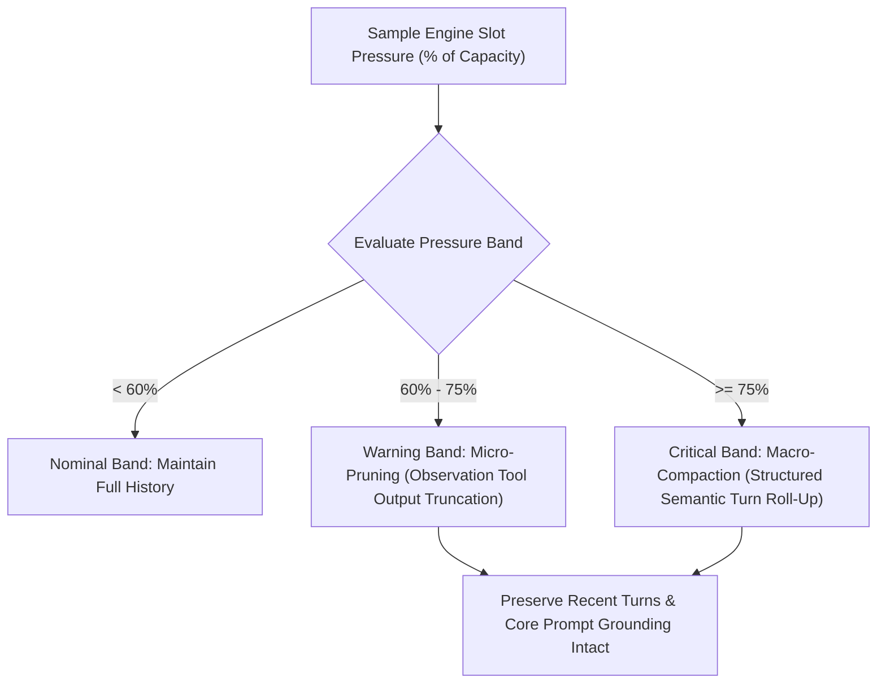

# ADR 0029: Dynamic Context Compaction and Attention Pruning Architecture

## Status
Accepted

## Date
2026-10-02

## Context
Local-first agentic coding models operate under constrained attention contexts (typically 4k to 32k tokens on consumer GPUs). In multi-turn development workflows involving iterative inspection, testing, and file modification, conversation histories expand monotonically.

Leaving prior conversational history unbounded causes several critical failure modes on local inference engines:
1. **Physical Slot Exhaustion**: Reaching context boundaries causes runtime errors or abrupt token truncation.
2. **Attention Dilution & "Lost in the Middle"**: Smaller local models (3B–8B parameters) suffer sharp reasoning degradation when required to attend across thousands of tokens of obsolete inspection outputs.
3. **Dead Weight from Ephemeral Observation**: When an agent inspects 100 lines of source code to locate a function, and then applies a modification in a subsequent turn, the original verbatim line dump becomes dead attention weight.

A structured compaction and pruning architecture is needed to preserve task execution across long-running multi-turn sessions without requiring hard session resets.

## Decision
We establish a **Dual-Tier Dynamic Context Compaction and Attention Pruning Architecture** governed by real-time inference slot pressure.

### 1. Separation of Responsibilities Across Context Beads
To prevent architectural fragmentation across ongoing initiatives, context lifecycle responsibilities are formally partitioned:
- **Explicit Reset Protocol**: Governs intentional user- or milestone-driven clean slates, resetting conversational trajectories and purging GPU KV cache allocations completely.
- **Dynamic Compaction & Attention Pruning Architecture**: Defines the tiered compaction mechanisms, attention retention invariants, and reasoning-to-token efficiency policies.
- **Slot-Aware Compaction Governor**: Manages the runtime monitoring daemon that samples inference slot metrics and invokes compaction passes during active multi-turn execution.

### 2. Dual-Tier Compaction Hierarchy
Context reduction operates progressively across two distinct tiers:

#### Tier 1: Micro-Pruning (Observation Tool Output Compaction)
- **Target**: Voluminous, ephemeral tool observation payloads from prior turns (such as large window line dumps, AST outlines, and non-error command output).
- **Mechanism**: Replaces older tool result bodies with lightweight metadata tombstones indicating the tool invoked, lines inspected, and outcome.
- **Safety**: Never modifies assistant reasoning traces, user instructions, error outputs, or final code diffs.
- **Trigger**: Activates when slot pressure crosses into the warning band (60%–75% of context capacity).

#### Tier 2: Macro-Compaction (Structured Semantic Roll-Up)
- **Target**: Entire sequences of older conversation turns.
- **Mechanism**: Condenses turns into a structured context ledger capturing:
  - The overarching user objective and active constraints.
  - Verified architectural findings and discovered file locations.
  - Completed modifications and passing test assertion states.
  - Immediate unresolved blockers or next actions.
- **Continuity Invariants**:
  - The foundational system prompt, environment grounding, and codebase context contracts are always preserved verbatim.
  - The initial user objective is preserved verbatim.
  - The most recent execution turns are retained verbatim to maintain local conversational continuity.
- **Trigger**: Activates when slot pressure breaches the critical threshold (≥75% of context capacity).

### 3. Reasoning Quality vs. Token Efficiency Evaluation Standards
Compaction mechanisms must be validated against deterministic multi-turn evaluation suites. Evaluation criteria require:
- **Zero Loss of Grounding**: System prompt identity, workspace paths, and tool schemas must remain untouched through repeated compaction cycles.
- **Error Context Retention**: Failed commands and compiler error traces must remain unpruned until a succeeding action resolves the failure.
- **Deterministic Token Reclamation**: Compaction must measurably recover at least 40% of consumed slot tokens in multi-turn editing sessions without degrading downstream test pass rates.

## Consequences

### Positive
- **Unbroken Multi-Turn Autonomy**: Agents can iterate through complex refactoring tasks spanning dozens of turns without hitting context exhaustion.
- **Enhanced Local Model Attention**: Pruning stale observations reduces distracting tokens, improving tool-calling accuracy on compact local models.
- **Deterministic Fallback Progression**: Lightweight observation pruning executes first; heavy semantic summarization only occurs when token pressure remains acute.

### Negative / Trade-offs
- **Loss of Granular Intermediate Output**: Earlier raw tool outputs cannot be re-examined without issuing fresh inspection commands.
- **Summarization Compute Cost**: Macro-compaction requires generating a structured summary turn when critical thresholds are breached.
