# ADR 0030: Headless Local IPC Sidecar Daemon Architecture

## Status
Accepted

## Date
2026-10-05

## Context
Following the presentation decoupling established in ADR 0017, external frontends—such as native graphical user interfaces (GUI), game engine overlays, or SDL-based status displays—require integration with the autonomous agent engine.

Integrating external graphical clients via in-process linking (such as dynamic C-shared bindings) introduces significant operational hazards:
1. **Memory & Crash Fault Propagation**: An unhandled engine panic, inference crash, or out-of-memory fault immediately terminates the host graphical application, crashing user windows and discarding unpersisted UI state. Conversely, a rendering stall or UI crash terminates active agent sessions mid-turn.
2. **Runtime Toolchain & Concurrency Conflicts**: GUI frameworks enforce rigid main-thread event loops and custom runtime schedulers that conflict with multi-threaded agent execution, subprocess management, and asynchronous streaming.
3. **Distribution & Packaging Complexity**: Distributing C-shared library bindings across diverse desktop environments requires coordinating compiler toolchains, C runtime ABIs, and dynamic linker paths, violating the zero-dependency pure static binary goal (ADR 0021).

To enable native GUI and external tool integrations while preserving absolute stability, we require an out-of-process architectural boundary.

## Decision
We establish a **Headless Local IPC Sidecar Daemon Architecture** that exposes the core agent engine over local inter-process communication (IPC) domain sockets using a streaming, line-delimited JSON-RPC protocol.

```mermaid
flowchart LR
    subgraph Client ["Client Process (GUI / SDL / External)"]
        UI["Native GUI / SDL Frontends"]
        IPCClient["IPC Client Runtime"]
    end

    subgraph Socket ["Local IPC Boundary"]
        UDS["Local UNIX Domain Socket / Named Pipe"]
    end

    subgraph Sidecar ["Headless Sidecar Daemon"]
        Daemon["IPC Daemon Server"]
        Sessions["Isolated Session Manager"]
        Engine["Core Agent Engine"]
    end

    subgraph Inference ["Local Inference"]
        Llama["llama-server"]
    end

    UI --> IPCClient
    IPCClient <-->|Line-delimited JSON-RPC & Events| UDS
    UDS <--> Daemon
    Daemon --> Sessions
    Sessions --> Engine
    Engine <-->|HTTP SSE Slots| Llama
```

### 1. Out-of-Process Process Boundary
The agent engine executes as an independent headless sidecar process. Desktop GUIs, system trays, and SDL clients communicate with the daemon exclusively over local domain sockets:
- Graphical client crashes do not disrupt background agent tasks or leave zombie processes.
- Engine panics or runtime faults are intercepted and converted into structured error notifications, guaranteeing the GUI client remains operational.

### 2. Streaming Line-Delimited Protocol
The daemon implements a bidirectional streaming protocol supporting:
- **Request / Response RPC**: Standardized lifecycle commands for session creation, prompt submission, status inspection, turn interruption, and history resets.
- **Asynchronous Notification Streams**: High-cadence real-time events for incremental token streaming, tool action proposals, tool execution results, context compaction notifications, and turn completion.
- **Interactive Action Approval Gates**: In non-autonomous mode, risky tool proposals suspend execution on an approval channel, emitting action proposal events and awaiting explicit operator approval or rejection from the client.

### 3. Fail-Safe Session & Connection Concurrency
- **Multiplexed Connection Contexts**: Client socket disconnections immediately cancel in-flight agent turns associated with that connection, preventing orphaned background execution or wedged session states.
- **Fault-Isolated Execution**: Engine panics during streaming turns or tool execution are captured with defer-recover harnesses, emitting sanitized failure notifications while preserving server socket availability for subsequent requests.
- **Fail-Safe Defaults**: Sessions default to interactive approval gating (`yolo: false`) unless explicitly configured otherwise by the connecting operator.

### 4. Zero-Dependency Pure Static Binary Policy
In accordance with ADR 0021, the daemon operates exclusively on deterministic native guardrail rules, eliminating runtime dynamic interpreter dependencies and compiling into a fully self-contained static binary.

## Consequences

### Positive
- **Complete Fault & Memory Isolation**: Frontends and the agent engine reside in separate address spaces; crashes in one do not destabilize the other.
- **Multi-Language Frontend Interoperability**: Any language capable of opening a domain socket and parsing line-delimited JSON (C, C++, Rust, Swift, Python, Go) can build rich graphical or terminal clients.
- **Headless & Embedded Flexibility**: The daemon functions identically as an independent system service or as a background sidecar spawned and supervised by a desktop GUI.
- **Unified Tool & Safety Invariants**: External clients automatically inherit core loop protections, progressive tool catalogs, and security regulation without reimplementing safety checks.

### Negative / Trade-offs
- **Transport Serialization Overhead**: Inter-process communication requires JSON serialization and socket buffering, introducing marginal latency compared to direct in-memory function calls.
- **Socket Lifecycle Governance**: Requires managing socket filesystem paths, permissions, stale socket cleanup, and platform-specific IPC transports.
