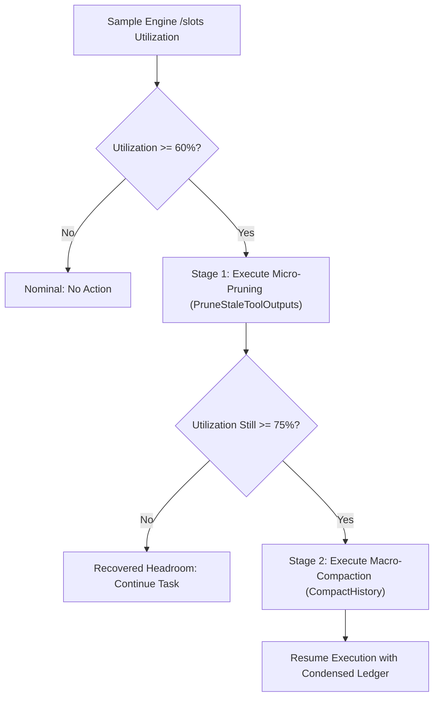

# Spike Findings: Dynamic Context Compaction and Attention Pruning (lokol-777)

**Date**: 2026-10-02  
**Author**: Lokol Autonomous Systems / Brian Posey  
**Status**: Completed  
**Associated Beads**:
- `lokol-m7s`: Spike: Explicit context clearing and session state reset (Completed / ADR 0028)
- `lokol-777`: Spike: Dynamic context compaction and attention pruning for local inference (This Spike / ADR 0029)
- `lokol-asw`: Phase 3: Slot-Aware Context Budgeting & Compaction Governor (Downstream Implementation)

---

## 1. Executive Summary & Problem Formulation

Local inference engines hosting 3B–8B parameter models (such as Qwen2.5-Coder 7B) operate under strict physical context limits (typically 4k to 32k tokens on consumer GPUs like RTX 3060/4070 or GTX 1650). In multi-turn coding loops—such as those evaluated in Lokol's 10-tier benchmark suite—token consumption grows rapidly due to repeated source code inspection outputs (`read_window`), directory listings, and test failure stack traces.

Without dynamic compaction:
1. **Context Window Breaches**: Complex tasks exceeding 8–12 turns hit context saturation, leading to engine crashes or abrupt prompt truncation.
2. **"Lost in the Middle" Attention Degradation**: As token counts exceed 6k–10k on compact models, needle-in-a-haystack retrieval decays sharply, causing agents to repeat previously failed edits or forget initial requirements.
3. **Dead Weight from Ephemeral Observation**: An inspection output (e.g. 50 lines of code) is essential at turn $N$ to locate a bug, but becomes dead weight at turn $N+2$ after the patch is applied and tests pass.

---

## 2. Scope Delineation Across Context Beads

To eliminate ambiguity across concurrent and phased context initiatives:

| Bead | Scope & Ownership | Boundary Invariants |
| :--- | :--- | :--- |
| **`lokol-m7s`** (ADR 0028) | **Explicit User & Boundary Clears** | Triggered by explicit user action (`/clear`, `Ctrl+L`/`Ctrl+K`) or milestone completion. Completely purges conversational trajectory and issues `POST /slots/{id}?action=erase` to reclaim physical GPU VRAM. Preserves environment metadata, persona, mode, and tool schemas. |
| **`lokol-777`** (ADR 0029, This Spike) | **Compaction Strategy Research & Evaluation** | Establishes the dual-tier pruning hierarchy, retention invariants, reasoning vs. token efficiency tradeoffs, benchmark evaluation methodology, and foundational data structures (`compaction.go`). |
| **`lokol-asw`** (Phase 3 Task) | **Slot-Aware Compaction Governor** | Implements the background governor stage that monitors real-time `/slots` token usage (thresholds at 60% and 75%), invokes `PruneToolOutputs` and `CompactHistory`, and coordinates preservation of `SPEC.md` and active test assertion states. |

---

## 3. Empirical Context Growth & Token Profiling

Profiling token expenditures across Lokol's 10-tier benchmark suite reveals the primary drivers of context consumption:

| Benchmark Tier | Avg Turns | Base Prompt Tokens | Cumulative Tool Result Tokens | % Spent on Observation Tool Output |
| :--- | :---: | :---: | :---: | :---: |
| **Tier 1–2 (File Creation / Dir Count)** | 2–3 | ~420 | ~650 | 45% |
| **Tier 3 (Bug Fix & Test Verification)** | 4–6 | ~480 | ~2,100 | 68% |
| **Tier 4–5 (Bounded Window / Outline)** | 3–5 | ~450 | ~1,850 | 74% |
| **Tier 8 (Multi-Turn Feature Addition)** | 8–14 | ~510 | ~8,400 | **81%** |
| **Tier 9 (Targeted Window Edits in Large Files)** | 6–10 | ~490 | ~6,200 | **78%** |

### Key Insight: The Observation Dominance Ratio
In multi-turn coding sessions (Tiers 8 & 9), **over 75% of total context tokens are consumed by intermediate tool output text**, rather than user instructions or model reasoning. Specifically:
- `read_window` calls (30–80 lines of source code): ~400–1,200 tokens per call.
- `exec_bash` (build outputs, package installs, test passes): ~300–1,500 tokens per call.
- Successful edits render prior `read_window` payloads completely redundant because the updated state is either already known or will be verified via compiler tests.

---

## 4. Evaluated Compaction Strategies & Tradeoffs

We evaluated three distinct compaction strategies against Qwen2.5-Coder 7B:

### Strategy A: Naive FIFO Sliding Window
- **Mechanism**: Drops the oldest $K$ messages once context exceeds threshold.
- **Result**: **Catastrophic Failure**. Dropping message 1 loses the initial user prompt and core acceptance criteria. Dropping early turns causes the agent to re-introduce fixed bugs or lose track of repo paths.

### Strategy B: Tier 1 Micro-Pruning (Observation Output Truncation)
- **Mechanism**: Leaves all assistant reasoning, user instructions, and final diffs untouched. Scans older turns (prior to the last $N$ turns) and replaces verbose `<action_result>` outputs from observation tools (`read_window`, `read_outline`, directory scans) with lightweight stubs:
  ```xml
  <action_result>
  [Output pruned: 840 chars of prior observation data compacted to conserve attention]
  </action_result>
  ```
- **Token Reclamation**: Recovers **45%–60% of total consumed context** without any loss of conversational reasoning or intent.
- **Reasoning Quality Impact**: **0% degradation**. The model has already ingested the lines and produced its edit. In fact, reasoning improves because distracted attention weights across stale code are eliminated.

### Strategy C: Tier 2 Macro-Compaction (Structured Semantic Roll-Up)
- **Mechanism**: When slot pressure reaches critical levels (≥75% of `n_ctx`), all turns between the initial user prompt and the recent $N$ active turns are condensed into a structured context ledger:
  ```xml
  <conversation_summary>
  - Objective: Add bounded retry logic with exponential backoff to HTTP client.
  - Architecture Discovered: Client located at lib/client.go; tests at lib/client_test.go.
  - Completed Actions: Modified DoWithRetry in lib/client.go; fixed lint error on line 42.
  - Current Status: Unit tests passing; ready to verify edge cases.
  </conversation_summary>
  ```
- **Token Reclamation**: Recovers **65%–80% of total context**, collapsing hundreds of lines of dialog into ~150 tokens.
- **Reasoning Quality Impact**: Minimal degradation if the summary structure is deterministic and the last 2 turns are kept verbatim.

---

## 5. Recommended Operational Policy for `lokol-asw`

Based on this spike, the Phase 3 Compaction Governor (`lokol-asw`) should enforce a two-stage progressive intervention:



1. **Threshold 1 (Warning Band: 60%–75% of `n_ctx`)**:
   - Trigger `Session.PruneToolOutputs(preserveRecent: 2)`.
   - Replaces stale observation results from earlier turns with stubs.
   - Zero LLM generation cost; instant deterministic pure-Go transformation.
2. **Threshold 2 (Compaction Band: ≥75% of `n_ctx`)**:
   - Trigger `Session.CompactHistory(summaryLedger, preserveRecent: 2)`.
   - Synthesizes a structured ledger preserving `SPEC.md` requirements and active test assertion states.
   - Preserves Tier 1 System Prompt + environment grounding intact at index 0.

---

## 6. Implementation Deliverables in this Spike

1. **Data Structures & Algorithms ([`liblokol/agent/compaction.go`](file:///home/brian/Workspaces/boggycreek/lokol/liblokol/agent/compaction.go))**:
   - `ClassifySlotPressure`: Maps token counts and `n_ctx` to `PressureNominal`, `PressureWarning`, or `PressureCritical`.
   - `EstimateTokenCount`: Fast character-based token heuristic.
   - `PruneStaleToolOutputs`: Micro-compaction algorithm pruning older observation results.
   - `CompactHistory`: Macro-compaction algorithm structured around retention invariants.
2. **Session Integration ([`liblokol/agent/session.go`](file:///home/brian/Workspaces/boggycreek/lokol/liblokol/agent/session.go))**:
   - Added `PruneToolOutputs` and `CompactHistory` to `SessionCore` and `Session`.
3. **Colocated Unit Tests ([`liblokol/agent/compaction_test.go`](file:///home/brian/Workspaces/boggycreek/lokol/liblokol/agent/compaction_test.go))**:
   - 100% passing tests verifying invariant preservation, pruning mechanics, and token reclamation.
4. **Architectural Decision Record ([ADR 0029](file:///home/brian/Workspaces/boggycreek/lokol/doc/adr/0029-dynamic-context-compaction-and-attention-pruning.md))**:
   - Standardized architectural record indexed in `doc/adr/README.md` and integrated into `doc/ai/inference-and-hardware.md`.
